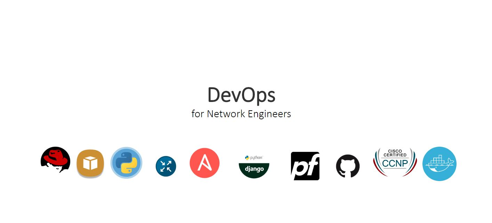

# Biography page
HTML and CSS are important when building websites. This design was done in PowerPoint and then converted to a webpage. The design was inspired by the new way of being Agile, and the increasing demand for solutions to network problems. Being a network engineer is not enough, thus the modern network engineer has to learn new skills in AWS, Linux, Python, Ansible, Git, docker, and network security.

### Demo
The site has been published on Github pages, [**check it out!**](www.google.com)

### Built with
* HTML
* CSS

### To-do
* Add a navigation bar
* Add a paragraph 
* Add responsiveness

### Feedback
Feel free to send me feedback on Twitter or file an issue. Feature requests are always welcome.